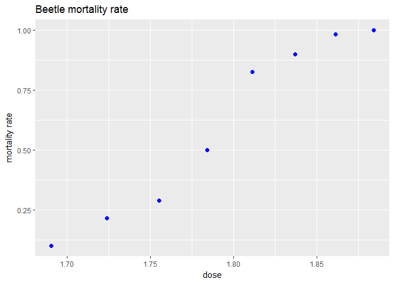
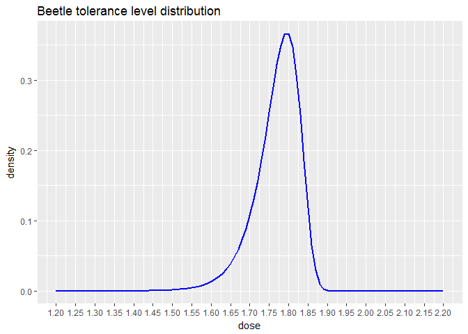

Regression for binary data
================

In this document, I will use three different link functions, logistic, probit and complementary log-log, to model the mortality rate of beetles after being exposed to gaseous carbon disulphide for 5 hours. The beetle mortality data set originally comes from an article of Bliss in 1935 and has been used by Dobson and Barnett as an example in their textbook on generalized linear models which I have been reading. What I am doing here is basically to implement this textbook example in R.

The structure of the beetle mortality data set is quite simple. It contains 8 observaions corresponding to 8 levels of gaseous carbon disulphide doses. For each observation, we have the number of beetles before the exposure and the number of beetles killed after the exposure. This is what the data looks like :

``` r
library(dplyr)
library(ggplot2)
beetle <- read.csv("beetle.csv",sep=" ",dec=".",header = FALSE)
names(beetle) <- c("dose","number","death")
ggplot(beetle,aes(x=dose,y=death/number))+
  geom_point(color="blue",size=2)+labs(y="mortality rate",title="Beetle mortality rate")
```



Since each individual beetle can only have two possible sorts, either alive or dead, the number of beetles killed at each of the 8 levels of dose follows a Bernoulli distribution with y success (number of beetles killed) in n trails (total number of beetles). Joining the Bernoulli distributions of the 8 observations together, we obtain the likelihood of the data that we would like to maximize to estimate the parameters of the model. For computational easiness, instead of maximizing the likelihood directly, we often choose to maximize the log likelihood which gives the same results given the monotonic property of log function.

``` r
x <- beetle %>%mutate(incp=1) %>%select(incp,dose)  %>% as.matrix
y <- beetle %>% select(death) %>% as.matrix()
n <- beetle %>% select(number) %>% as.matrix()
```

Link function
-------------

The link function used in binomial regression maps a value bounded within the interval of 0 to 1 to an unbounded value that a linear predictor can output. The bounded value corresponds to the probability of success in each trial in a Bernoulli distribution. And the linear predictor is the inner product between a feature vector that comes from the data and a vector of parameters to be estimated.

A way of interpreting this is to consider each individual binary outcome as the manifest of an unobservable continuous random variable such that the outcome is 1 when the unobservable continuous random variable exceeds a certain threshold and 0 otherwise. This unobservable continuous random variable is called the latent variable. The latent variable can be modeled as the linear predictor plus some errors where the linear predicted is a constant given the data and the parameters and the errors follow some kinds of probability distributions. If we consider the distribution of the latent variable standardized around zero and take the threshold to be zero, the probability of success in each trial of a Bernoulli distribution can then be seen as the probability that the value of the latent variable exceeds zero. This is equivalent to the probability that the error exceed the negative of the linear predictor, which can be expressed by the cumulative distribution function (CDF) of the errors evaluated at the value of the linear predictor.

When a normal distribution is assumed for the errors, the resulting model is a probit model. The inverse link function that maps the linear predictor to an interval of 0 to 1 is the CDF of a normal distribution. When a logistic distribution is assumed, the resulting model is a logistic model. When a log-Weibull distribution is assumed, the resulting model is a complementary log-log model.

Method of scoring
-----------------

The method of scoring, also known as Fisher's scoring, is a way of maximizing the likelihood to estimate the parameters using a score statistic and an information matrix that can be computed from the data. The score statistic is just the gradient of the likelihood with respect the parameters. The information matrix is the variance of the score statistic. The method of scoring is a form of Newton's method that approximates the root of a function. Here, the function whose root we try to approximate is the gradient.

In the following codes, I use the method of scoring to estimate the parameters of the logit, the probit and the complementary log-log model. The score statistics can be calculated by applying the chain rule in taking the derivatives. The information matrix dan calculated by taking the expected value of the squared score statistics.

``` r
#### Logit ####
# Initialize
b_logit <- c(0,0)
change <- 1
while (change > 10^-6){
# Probability
prob <- exp(x%*%b_logit)/(1+exp(x%*%b_logit))
# Score
u <- t(x) %*%(y-n*prob)
# Information
w <- matrix(0,nrow=nrow(x),ncol=nrow(x))
diag(w)<-n*prob*(1-prob)
i <- t(x)%*%w %*% x
# Update
b_logit_n <- b_logit+solve(i)%*%u
change <- sqrt(sum((b_logit_n-b_logit)^2))
b_logit <- b_logit_n
}

#### Probit ####
# Initialize
b_probit <- c(0,0)
change <- 1

while(change > 10^-6){
# Probability
prob <- pnorm(x%*%b_probit)
# Score 
u <- t(x)%*% (((y-n*prob)/(prob*(1-prob)))*dnorm(x%*%b_probit))
# Information
w <- matrix(0,nrow=nrow(x),ncol=nrow(x))
diag(w)<- n*dnorm(x%*%b_probit)^2/(prob*(1-prob))
i <- t(x)%*%w %*% x
# Update
b_probit_n <-b_probit+solve(i)%*%u
change <- sqrt(sum((b_probit_n-b_probit)^2))
b_probit <- b_probit_n
}

#### Complementary log-log ####
b_cll <-c(0,0)
change <- 1
while(change > 10^-6){
# Probability
prob <- 1-exp(-exp(x%*%b_cll))
# Score
u <- t(x)%*%(((y-n*prob)/(prob*(1-prob)))*(exp(x%*%b_cll-exp(x%*%b_cll))))
# Information
w <- matrix(0,nrow=nrow(x),ncol=nrow(x))
diag(w)<- n*exp(x%*%b_cll-exp(x%*%b_cll))^2/(prob*(1-prob))
i <- t(x)%*%w %*% x
b_cll_n <-b_cll+solve(i)%*%u
change <- sqrt(sum((b_cll_n-b_cll)^2))
b_cll <- b_cll_n
}
```

Deviance
--------

In binomial regression, the deviance statistic does not involve the nuisance parameter as it does in linear regression. Consequently, we can compute the deviance statistics of the three models directly and choose the one that best fits the data accordingly.

``` r
## Logit
prob <- exp(x%*%b_logit)/(1+exp(x%*%b_logit))
y_hat_logit <- n*prob
D_logit <- 2*sum(y*log(y/y_hat_logit)+
                   (n-y)*(ifelse(
                     is.infinite(log(n-y)),0,log(n-y))-log(n-y_hat_logit)))
## Probit
prob <- pnorm(x%*%b_probit)
y_hat_probit <- n*prob
D_probit <- 2*sum(y*log(y/y_hat_probit)+
                    (n-y)*(ifelse(
                      is.infinite(log(n-y)),0,log(n-y))-log(n-y_hat_probit)))
## Complementary log-log
prob <- 1-exp(-exp(x%*%b_cll))
y_hat_cll <- n*prob
D_cll <- 2*sum(y*log(y/y_hat_cll)+
                 (n-y)*(
                   ifelse(is.infinite(log(n-y)),0,log(n-y))-log(n-y_hat_cll)))
```

If the model fits the data well, the deviance statistics should follow a chi-squared distribution with 6 degrees of freedom (8 observation-2 parameters in the model). From the results below, we can observe that given a chi-squared distribution of 6 degrees of freedom, it is more likely to observe the deviance statistic of the complementary log-log model than the other two models. We can ,therefore, conclude that the complementary log-log model fits our data the best.

``` r
pchisq(D_logit,df=6,lower.tail=FALSE)
```

    ## [1] 0.08145881

``` r
pchisq(D_probit,df=6,lower.tail=FALSE)
```

    ## [1] 0.1196985

``` r
pchisq(D_cll,df=6,lower.tail=FALSE)
```

    ## [1] 0.7510816

Latent variable interpretation
------------------------------

To interpret the result, we can consider the latent variable to be the excess dose of gaseous carbon disulphide that the beetles are subject to. The excess dose can modeled as the difference between a linear predictor which is the dose of gaseous carbon disulphide weighted by the estimated parameters and a random variable that captures the varying tolerance level of each beetle. When the weighted gaseous carbon disulphide equals or exceeds the tolerance level of a beetle, the excess dose is greater or equal to 0 and the beetle dies. This can be defined formally as :

Y = XB - t

Pr(Y&gt;=0) = Pr(t &lt;= XB)

with Y being the latent variable, XB the linear predictor and t the tolerance level random variable. The probability that a random variable is smaller or equal to a given value is its cdf evaluated at this value. Since we have decided to use the complementary log-log model, the tolerance random variable should follow a log-Weibull distribution. The distribution of the tolerance level of beetles would look like the following :

``` r
logweibull <- function(x){
 exp(b_cll[1]+b_cll[2]*x-exp(b_cll[1]+b_cll[2]*x))
}
ggplot(data.frame(x=c(1.2,2.2)), aes(x)) +
  stat_function(fun=function(x)logweibull(x),size=1,color="blue")+
  labs(x="dose",y="density",title="Beetle tolerance level distribution")+
  scale_x_continuous(breaks = seq(1.2,2.2,0.05)) 
```



The fact that this distribution peaks at around 1.8 confirmed what we saw from the earlier graph that most beetles die with a dose of gaseous carbon disulphide higher than 1.8.

Reference
---------

-   Annette J. Dobson, Adrian G. Barnett (2008). An Introduction to Generalized Linear Models. Chapman & Hall/CRC texts in statistical science series.

-   Rodríguez, G. (2007). Lecture Notes on Generalized Linear Models. URL: <http://data.princeton.edu/wws509/notes/>
