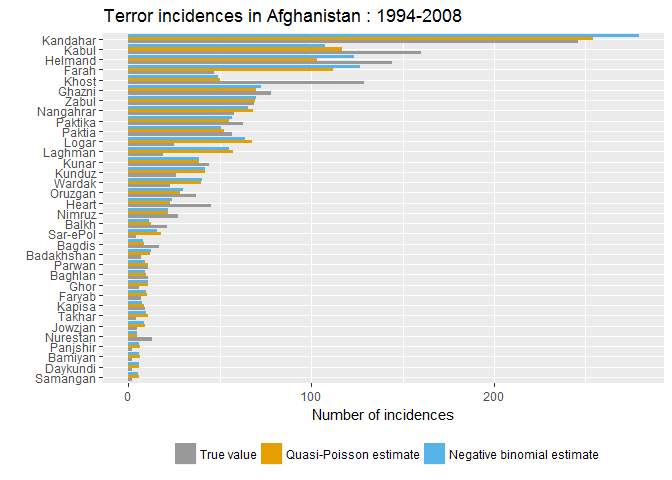

Regression model for count data
================

In this document, I will use Poisson, Quasi-Poisson and Negative binomial regressions to model the number of terror incidences occurred in Afghanistan from 1994 to 2008. The data set used here can be found on the [website](http://www.stat.ufl.edu/~winner/datasets.html) of the Department of Statistics of the University of Florida.

Data exploration
----------------

The data set contains the aggregated number of terror incidences occurred in 34 provinces of Afghanistan from 1994 to 2008 along with some characteristics of these provinces. The characteristics include the average opium cultivation in hectares (*opium*), the population in thousands (*population*), the area in thousand square kilometers (*area*), the percentage of mountainous area (*mountain*), the literacy rate (*literacy*), the percentage of the population living below the minimal calory intake level (*belowcalories*),the percentage of the population with access to drinking water (*water*), the percentage of all-season roads (*road*), the mortality rate of children under five (*under5mort*),the number of foreign troops present (*foreigntroop*) and whether the province is Pashtun majority (*pashtun*). The data set also contains the aggregated number of casualties caused by the terror incidences, which is not the subject of the models here.

The number of terror incidences occurred in each of the 34 provinces are presented in the following graph. Kandahar is the province where there have been the most terror incidences, followed by Kabul and Helmand.

``` r
library(dplyr)
library(ggplot2)
library(corrplot)

terr <- read.table("http://www.stat.ufl.edu/~winner/data/afghan_terror.dat")
names(terr) <- c("province","incidence","casualty","opium","population",
                 "area","mountain","literacy","water","belowcalories",
                 "road","under5mort","pashtun","foreigntroop")


ggplot(terr,aes(x=reorder(province,incidence),y=incidence))+
  geom_bar(stat = "identity")+
  coord_flip()+
  labs(title="Terror incidences in Afghanistan : 1994-2008",
       y="Number of incidences",
       x="")
```


In the below correlation plot, the access to drinking water, the percentage of all-season roads, the mortality rate of children under 5 and Pashtun majority appear to be the factors the most correlated with the number of terror incidences. While correlation does not imply causation, from the point of view of fitting a regression model, these variables make good candidates to be included in the model.

``` r
M <- cor(subset(terr,select=-province))

corrplot(M,method="number",mar=c(1,0,1,0),number.cex=0.75)
```


Poisson model
-------------

We first begin with a Poisson model. As the Poisson model is in the family of Generalized linear models, the parameters can be estimated through the score statistics and the information matrix. I will first start with a model that includes only the access to drinking water as the explanatory variable. The codes below compute the parameters and the associated standard errors. The results are then checked against those given by the **glm** function.

``` r
D <- model.matrix(~water,data=terr)
y <- terr %>% select(incidence) %>% as.matrix()
b <- rep(0.0001,2)
change <- 1
while (change > 10^-6){
meanr <- exp(D %*% b)
# score
u <- t(D)%*%(y-meanr)
# information
w <- matrix(0,nrow=nrow(D),ncol=nrow(D))
diag(w)<- meanr
i <- t(D)%*%w %*% D
# update
b_n <- b+solve(i)%*%u
change <- sqrt(sum((b_n-b)^2))
b <- b_n
}
p_1 <- glm(y~D-1,family=poisson)
data.frame(estimate=unname(b),se=sqrt(diag(solve(i))),
           zscore=unname(b/sqrt(diag(solve(i)))),
           pvalue=pnorm(unname(b/sqrt(diag(solve(i)))),lower.tail=FALSE)*2)
```

    ##               estimate          se   zscore        pvalue
    ## (Intercept) 2.09257513 0.068462211 30.56540 3.529866e-205
    ## water       0.04855052 0.001566712 30.98879 7.631760e-211

``` r
abs(b-p_1$coefficients)< 1e-4 
```

    ##             incidence
    ## (Intercept)      TRUE
    ## water            TRUE

``` r
abs(sqrt(diag(solve(i)))-sqrt(diag(vcov(p_1))))< 1e-4 
```

    ## (Intercept)       water 
    ##        TRUE        TRUE

Note that while the access to drinking water appears to have a significant effect on the number of terror incidences, the model as a whole does not fit the data. The goodness of fit of the model can be checked with Pearson's chi-squared statistic or the deviance statistic. We can calculate the two statistics by ourselves or we can use the Pearson's residuals and the deviance statistic already included in the fitted model given by **glm**. If the model fits the data well, we should expect the two statistics to follow a chi-squared distribution with the degree of freedom the number of observations minus the number of parameters. This is obvious not the case here as the probability of observing these two statistics from a chi-squared distribution with 32 degree of freedom (34 observations-2 paramters) is almost 0. In fact, since the chi-squared distribution has its mean equals the degree of freedom, we should expect to see these two statistics be around 32 (34 observations-2 paramters) if the model fits well.

``` r
## Pearson's chi-squared statistic
meanr <- exp(D %*% b)
chi_sq <- colSums((y-meanr)^2/meanr)
abs(chi_sq-sum(residuals(p_1, type = "pearson")^2)) < 1e-4
```

    ## incidence 
    ##      TRUE

``` r
c(pearson=unname(chi_sq),
  p_value=unname(pchisq(chi_sq,df=nrow(D)-ncol(D),lower.tail = FALSE)))
```

    ##       pearson       p_value 
    ##  1.020522e+03 8.124505e-194

``` r
## Deviance statistic
deviance <- 2*colSums(y*log(y/meanr)-(y-meanr))
abs(deviance-deviance(p_1))< 1e-4 
```

    ## incidence 
    ##      TRUE

``` r
c(deviance=unname(deviance),
  pvalue=unname(pchisq(deviance,df=nrow(D)-ncol(D),lower.tail = FALSE)))
```

    ##      deviance        pvalue 
    ##  8.691197e+02 5.527250e-162

Although the lack of fit can be due to the variables included in the model, it is shown below that while adding more variables does improve the statistics, they remain far from the expected value even when we reach an "optimal" model according to the likelihood ratio test.

The codes below begins with the simplest model with only the intercept and add one explanatory variable at a time by choosing the one that makes the largest improvement to the log likelihood and stops when no more variable can bring a significant improvement. In the final model obtained, the explanatory variables included are all strongly significant individually. However, the deviance statistic (and Pearson's statistic) still remains far too large. This is suggesting that the Poisson model is probably not the best tool to use to model the data here.

``` r
## Poisson
varlist <- names(terr)[!names(terr) %in%c("incidence","casualty","province")]
p_0 <- glm(incidence~1,data=terr,family=poisson)
prob <- 0
n_var <- 0

while (prob <0.05){
  prob<- 1
  n_var <- n_var+1
  for (i in 1:length(varlist))
  {
    if (!varlist[i]%in%
        names(get(sprintf("p_%d",n_var-1))$coefficients))
    {
      p_temp <- update(get(sprintf("p_%d",n_var-1)),paste(" ~.+",varlist[i]))
      anov <-anova(p_temp,test="Chisq")
      prob_temp <-anov$`Pr(>Chi)`[n_var+1]
      if (prob_temp < prob && prob_temp<0.05)
      {
        assign(sprintf("p_%d",n_var),p_temp)
        prob <- prob_temp
      }
    }
  }
}

p_fit <- get(ifelse(exists(sprintf("p_%d",n_var)),
                    sprintf("p_%d",n_var),
                    sprintf("p_%d",n_var-1)))

summary(p_fit)
```

    ## 
    ## Call:
    ## glm(formula = incidence ~ pashtun + water + area + population + 
    ##     literacy + foreigntroop + under5mort + belowcalories, family = poisson, 
    ##     data = terr)
    ## 
    ## Deviance Residuals: 
    ##     Min       1Q   Median       3Q      Max  
    ## -5.6309  -2.0621  -0.3931   1.2861   8.1975  
    ## 
    ## Coefficients:
    ##                 Estimate Std. Error z value Pr(>|z|)    
    ## (Intercept)   -9.800e-01  3.937e-01  -2.489  0.01281 *  
    ## pashtun        1.602e+00  1.000e-01  16.025  < 2e-16 ***
    ## water          2.420e-02  2.369e-03  10.213  < 2e-16 ***
    ## area           2.222e-02  2.359e-03   9.421  < 2e-16 ***
    ## population     2.650e-04  8.632e-05   3.070  0.00214 ** 
    ## literacy       2.895e-02  3.719e-03   7.785 6.96e-15 ***
    ## foreigntroop   1.334e-04  2.713e-05   4.916 8.83e-07 ***
    ## under5mort     3.399e-03  1.069e-03   3.178  0.00148 ** 
    ## belowcalories  1.009e-02  3.231e-03   3.125  0.00178 ** 
    ## ---
    ## Signif. codes:  0 '***' 0.001 '**' 0.01 '*' 0.05 '.' 0.1 ' ' 1
    ## 
    ## (Dispersion parameter for poisson family taken to be 1)
    ## 
    ##     Null deviance: 1767.19  on 33  degrees of freedom
    ## Residual deviance:  233.72  on 25  degrees of freedom
    ## AIC: 415.3
    ## 
    ## Number of Fisher Scoring iterations: 5

Quasi-Poisson
-------------

Poisson distribution assumes the mean to be equal to the variance. This assumption, however, does not always hold true in real-world data where the variance is often found to be a lot greater than the mean. This situation is called the overdispersion. If we release the equality assumption and assume instead the variance to be proportional to the mean at a scale parameter, we arrive at the quasi-Poisson model.

The correction made to the variance in the quasi-Poisson model does not change the estimated parameters from the original Poisson model, however, it does influence the standard errors associated with the parameters. The scale parameter that links the mean and the variance in the quasi-Poisson model can be estimated by dividing Pearson's chi-squared statistic by its degree of freedom. We then multiply the standard errors of the original model by the square root of the scale parameter to obtain the "corrected" standard errors. Since the standard errors become larger, the estimated parameters appear less significant in the quasi-Poisson model than in the original model. The scale parameter is estimated to be around 9 here. Hence, the standard errors in the quasi-Poisson model are about 3 times larger than that in the original Poisson model. This can be verified by comparing the output of **glm** below when the *family* argument is set to *quasipoisson* with that of the earlier one when the family argument was set to *poisson*.

``` r
phi <- sum(residuals(p_fit,"pearson")^2)/df.residual(p_fit)
phi;sqrt(phi)
```

    ## [1] 9.992348

    ## [1] 3.161068

``` r
qp_fit <- glm(formula(p_fit),family=quasipoisson,data=terr)
summary(qp_fit)
```

    ## 
    ## Call:
    ## glm(formula = formula(p_fit), family = quasipoisson, data = terr)
    ## 
    ## Deviance Residuals: 
    ##     Min       1Q   Median       3Q      Max  
    ## -5.6309  -2.0621  -0.3931   1.2861   8.1975  
    ## 
    ## Coefficients:
    ##                 Estimate Std. Error t value Pr(>|t|)    
    ## (Intercept)   -9.800e-01  1.245e+00  -0.787  0.43846    
    ## pashtun        1.602e+00  3.161e-01   5.070 3.11e-05 ***
    ## water          2.420e-02  7.489e-03   3.231  0.00345 ** 
    ## area           2.222e-02  7.457e-03   2.980  0.00633 ** 
    ## population     2.650e-04  2.729e-04   0.971  0.34073    
    ## literacy       2.895e-02  1.176e-02   2.463  0.02102 *  
    ## foreigntroop   1.334e-04  8.577e-05   1.555  0.13247    
    ## under5mort     3.399e-03  3.381e-03   1.005  0.32434    
    ## belowcalories  1.009e-02  1.021e-02   0.988  0.33240    
    ## ---
    ## Signif. codes:  0 '***' 0.001 '**' 0.01 '*' 0.05 '.' 0.1 ' ' 1
    ## 
    ## (Dispersion parameter for quasipoisson family taken to be 9.992349)
    ## 
    ##     Null deviance: 1767.19  on 33  degrees of freedom
    ## Residual deviance:  233.72  on 25  degrees of freedom
    ## AIC: NA
    ## 
    ## Number of Fisher Scoring iterations: 5

The model selection through the log likelihood ratio as we did before with the Poisson model is no longer suitable here since the quasi-Poisson model is estimated through a quasi-likelihood. Instead, we can use the General linear F-test so that the scale parameter will appear in both the numerator and the denominator and cancel each other out.

``` r
qp_0 <- glm(incidence~1,data=terr,family=quasipoisson)
prob <- 0
n_var <- 0

while (prob <0.05){
  prob<- 1
  n_var <- n_var+1
  for (i in 1:length(varlist))
  {
    if (!varlist[i]%in% 
        names(get(sprintf("qp_%d",n_var-1))$coefficients))
    {
      qp_temp <- update(get(sprintf("qp_%d",n_var-1)),paste(" ~.+",varlist[i]))
      anov <-anova(qp_temp,test="F")
      prob_temp <-anov$`Pr(>F)`[n_var+1]
      if (prob_temp < prob && prob_temp<0.05)
      {
        assign(sprintf("qp_%d",n_var),qp_temp)
        prob <- prob_temp
      }
    }
  }
}

qp_fit <- get(ifelse(exists(sprintf("qp_%d",n_var)),
                    sprintf("qp_%d",n_var),
                    sprintf("qp_%d",n_var-1)))
summary(qp_fit)
```

    ## 
    ## Call:
    ## glm(formula = incidence ~ pashtun + water + area, family = quasipoisson, 
    ##     data = terr)
    ## 
    ## Deviance Residuals: 
    ##     Min       1Q   Median       3Q      Max  
    ## -6.9460  -1.9732  -0.2729   1.0653   9.2429  
    ## 
    ## Coefficients:
    ##             Estimate Std. Error t value Pr(>|t|)    
    ## (Intercept) 1.398270   0.294346   4.750 4.71e-05 ***
    ## pashtun     1.532700   0.283566   5.405 7.42e-06 ***
    ## water       0.027059   0.006148   4.401 0.000126 ***
    ## area        0.016193   0.004373   3.703 0.000857 ***
    ## ---
    ## Signif. codes:  0 '***' 0.001 '**' 0.01 '*' 0.05 '.' 0.1 ' ' 1
    ## 
    ## (Dispersion parameter for quasipoisson family taken to be 11.65072)
    ## 
    ##     Null deviance: 1767.19  on 33  degrees of freedom
    ## Residual deviance:  338.64  on 30  degrees of freedom
    ## AIC: NA
    ## 
    ## Number of Fisher Scoring iterations: 5

In the final model, the three variables retained in the model are *water*, *area* and *pashtun*.

Negative binomial model
-----------------------

An alternative way to deal with the problem of overdispersion is to assume that the outcome, besides following a Poisson distribution, is also affected by an unobserved random effect. When the unobserved effect is assumed to follow a gamma distribution, we obtain a Negative binomial distribution for the outcome unconditioned on the unobserved effect. The Negative binomial model can be estimated by the **glm.nb** function in the **MASS** package. In the following codes, we perform again the model selection through the log likelihood ratio test.

``` r
library(MASS)
n_0 <- glm.nb(incidence~1,data=terr)
prob <- 0
n_var <- 0
while (prob <0.05){
prob <- 1
n_var <- n_var+1
for (i in 1:length(varlist))
{
if (!varlist[i]%in%
        names(get(sprintf("n_%d",n_var-1))$coefficients))
  {
  n_temp <- update(get(sprintf("n_%d",n_var-1)),paste(" ~.+",varlist[i]))
  anov <-anova(get(sprintf("n_%d",n_var-1)),n_temp)
  prob_temp <- anov$`Pr(Chi)`[2]
  if (prob_temp < prob && prob_temp<0.05)
  {
    assign(sprintf("n_%d",n_var),n_temp)
    prob <- prob_temp
  }
  }
}
}

n_fit <- get(ifelse(exists(sprintf("n_%d",n_var)),
                    sprintf("n_%d",n_var),
                    sprintf("n_%d",n_var-1)))
summary(n_fit)
```

    ## 
    ## Call:
    ## glm.nb(formula = incidence ~ pashtun + area + water, data = terr, 
    ##     init.theta = 3.516783319, link = log)
    ## 
    ## Deviance Residuals: 
    ##     Min       1Q   Median       3Q      Max  
    ## -1.7937  -1.1088  -0.1244   0.3178   2.1144  
    ## 
    ## Coefficients:
    ##             Estimate Std. Error z value Pr(>|z|)    
    ## (Intercept) 1.304414   0.247541   5.269 1.37e-07 ***
    ## pashtun     1.643308   0.231024   7.113 1.13e-12 ***
    ## area        0.019815   0.006047   3.277  0.00105 ** 
    ## water       0.025217   0.007802   3.232  0.00123 ** 
    ## ---
    ## Signif. codes:  0 '***' 0.001 '**' 0.01 '*' 0.05 '.' 0.1 ' ' 1
    ## 
    ## (Dispersion parameter for Negative Binomial(3.5168) family taken to be 1)
    ## 
    ##     Null deviance: 157.290  on 33  degrees of freedom
    ## Residual deviance:  35.842  on 30  degrees of freedom
    ## AIC: 278.3
    ## 
    ## Number of Fisher Scoring iterations: 1
    ## 
    ## 
    ##               Theta:  3.52 
    ##           Std. Err.:  1.03 
    ## 
    ##  2 x log-likelihood:  -268.303

``` r
c(deviance=deviance(n_fit),pvalue=pchisq(deviance(n_fit),df=n_fit$df.residual,lower.tail=FALSE))
```

    ##   deviance     pvalue 
    ## 35.8422129  0.2132886

The same three variables, *water*, *area* and *pashtun*, are retained in the final model of the negative binomial regression as in the quasi-Poisson regression. The deviance statistic of the negative binomial model is about 36, which is a reasonable value given a degree of freedom of 30.

Result
------

If we look back to the correlation plot presented earlier, we can notice that two of the variables that appeared to be the most correlated with the number of terror incidences in the correlation plot, all-season roads and the mortality rate of children under five, are not retained in the final model. This can be explained by the fact that the two variables are also highly correlated with the access to drinking water, whose inclusion in the model alone suffices to capture the effects of the two variables. On the other hand, the area of the province who did not appear to be particularly correlated with the number of terror incidences ends up capturing some effects left out by the other variables and is retained in the final model.

It can be seen below that the estimated parameters and the associated standard errors are not very different in the quasi-Poisson model and the Negative binomial model.

``` r
data.frame(estimate_quasipois=qp_fit$coefficients,
           estimate_nbinom=n_fit$coefficients,
           se_quasi=sqrt(diag(vcov(qp_fit))),
           se_nbinom=sqrt(diag(vcov(n_fit))))
```

    ##             estimate_quasipois estimate_nbinom    se_quasi   se_nbinom
    ## (Intercept)         1.39826994      1.30441401 0.294345777 0.247541226
    ## pashtun             1.53270013      1.64330771 0.283565504 0.231024115
    ## water               0.02705914      0.01981507 0.006148208 0.006046508
    ## area                0.01619296      0.02521707 0.004372571 0.007802076

Based on the parameter estimated in the Negative binomial model, being a Pashtun majority province increases the expected number of terror incidence by about 5 (exponentiel of 1.64). An increase of the area by one kilometer square increases the expected number of terror incidence by about 1. An increase of the percentage of the population with access to drinking water by one percent also increases the expected number of terror incidences by about 1. While the positive effects of the first two explanatory variables on the number of terror incidences are somehow expected, the positive effect of the third variable, the access to drinking water, is more surprising.

``` r
exp(n_fit$coefficients[-1])
```

    ##  pashtun     area    water 
    ## 5.172250 1.020013 1.025538

With the parameter given in the output of **glm.nb**, we can plot the density of the gamma distribution that characterizes the unobserved random effect. The value of the first, second and third quartile of the distribution are 0.6, 0.9 and 1.3. This implies that the number of terror incidences of a province that falls at the first quartile of this distribution will be 40% lower than the value expected from its characteristics. This number will be 10% lower if the province falls at the second quartile of the distribution and 30% higher if the province falls at the third quartile. Of course, we have no way of knowing which province falls at which quartile, else we could have just included this effect as an explanatory in a Poisson model.

``` r
x <- seq(0, 3, 0.01)
gd <- data.frame(x, g = dgamma(x, shape = n_fit$theta,rate = n_fit$theta))
ggplot(gd, aes(x, g)) + geom_line(size=1)+
  geom_vline(xintercept=qgamma(c(0.25,0.5,0.75),shape = n_fit$theta,
                               rate = n_fit$theta),linetype = "longdash")+
  labs(x="Unobserved random effect",y="Density")+
   annotate(geom="text",
            x=qgamma(c(0.25,0.5,0.75),shape = n_fit$theta,
                     rate = n_fit$theta)-0.1, y=0, 
            label=round(qgamma(c(0.25,0.5,0.75),shape = n_fit$theta,
                                rate = n_fit$theta),1))
```


The true number of terror incidences and the number estimated by the quasi-Poisson and the Negative binomial model are presented in the graph below. In most cases, the two models provide a reasonable estimate of the number of terror incidences. Some exceptions include Khost and Nurestan where the number of terror incidences is largely underestimated and Sar-ePol where it is overestimated.

``` r
result <- data.frame(province=terr$province,
                     true=n_fit$model$incidence,
                     quasi= qp_fit$fitted.values,
                     nbinom = n_fit$fitted.values
                     )


result <- reshape2::melt(result,idvar=c("province"))


ggplot(result,aes(x=reorder(province,value),
                  y=value,fill=as.factor(variable)))+
  geom_bar(position="dodge",stat = "identity")+
  scale_fill_manual(values=c("#999999", "#E69F00", "#56B4E9"),
    name="",breaks=c("true", "quasi", "nbinom"),
    labels=c("True value", "Quasi-Poisson estimate", "Negative binomial estimate"))+
  coord_flip()+
  labs(title="Terror incidences in Afghanistan : 1994-2008",
       y="Number of incidences",
       x="")+
   theme(legend.position="bottom")
```



Reference
---------

-   Annette J. Dobson, Adrian G. Barnett (2008). An Introduction to Generalized Linear Models. Chapman & Hall/CRC texts in statistical science series.

-   Rodriguez, G. (2007). Lecture Notes on Generalized Linear Models. URL: <http://data.princeton.edu/wws509/notes/>
