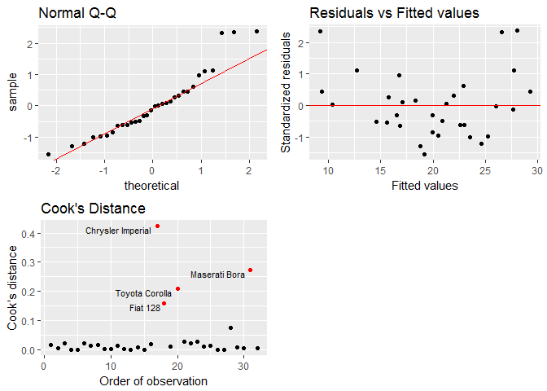

Normal Linear Model
================

This document is about fitting a normal linear model. I will start with a full model, test the significance of each individual explanatory variable (Wald test) then compare the goodness of fit of the full model to some more restricted ones (General linear F test). I will also measure the coefficient of determination of the fitted model (R-squared) and examine the adequacy of the assumptions of the normal linear model by looking at the residuals. All of these tests can be carried out easily with **lm** or **glm** functions in R. However, to gain a better understanding of what is going on under the hood, I will compute these tests myself and compare the results with those given by R functions.

Data
----

The data that I am trying to fit here is the fuel consumption (miles per gallon) of different types of automobiles. The data comes from the **mtcars** data set in R which contains the fuel consumption and other characteristics of different types of automobiles. The core assumption of the normal linear model is the normal distribution of the response variable. We can verify this assumption by looking at the normal quantile-quantile plot of the fuel consumption data. As can be seen from the following plots, the distribution of the original data is skewed to the right. After log transformation, the data looks a lot more like a normal distribution. I therefore use the log transformed fuel consumption as response variable. It should be noted that, given the small size of the data set (32 observations), we shouldn't be expecting to see a beautiful bell curve anyway.

``` r
data("mtcars")
library(dplyr)
library(ggplot2)
library(gridExtra)
library(htmlTable)

Y <- mtcars %>% select(mpg) %>% as.matrix()
ggQQ <- function(vec,title="") 
{
  y <- quantile(vec[,1], c(0.25, 0.75))
  x <- qnorm(c(0.25, 0.75))
  slope <- diff(y)/diff(x)
  int <- y[1L] - slope * x[1L]
  p <- ggplot(vec,aes(sample=vec[,1])) +
    stat_qq() +
    geom_abline(slope = slope, intercept = int, color="red")+labs(title=title)
  
  return(p)
}

histy <- ggplot(data.frame(Y),aes(mpg))+
  geom_histogram(bins=10)+
  labs(title="Fuel Consumption")
histy_t <-ggplot(data.frame(log(Y)),aes(mpg))+
  geom_histogram(bins=10)+
  labs(title="Log Fuel Consumption")
qqy <-ggQQ(data.frame((Y-mean(Y))/sd(Y)))
qqy_t <- ggQQ(data.frame((log(Y)-mean(log(Y)))/sd(log(Y))))


grid.arrange(histy,histy_t,qqy,qqy_t,ncol=2)
```


``` r
Y <- log(Y)
```

To model fuel consumption (mpg), I will start with a full model that includes the number of cylinders(cyl), the displacement (disp), the gross horsepower (hp), the rear axle ratio (drat), the weight of the automobiles (wt) and the 1/4 mile time (qsec) as explanatory variables. Whether it is from maximizing the likelihood of the data or minimizing the squared errors, we arrive at the same formula to compute the estimated parameters which is the pseudo inverse of \(X\).

``` r
X<- mtcars %>% mutate(incp=1,cyl_6=ifelse(cyl==6,1,0),cyl_8=ifelse(cyl==8,1,0)) %>% 
  select(incp,cyl_6,cyl_8,disp,hp,drat,wt,qsec)%>% as.matrix()
n <- nrow(X)
lmfit <- function(x,y){
df <- ncol(x)
b <- solve(t(x)%*%x)%*%t(x)%*%y  #pseudo inverse
y_hat <- x%*%b
rss <-  t(y-y_hat) %*% (y-y_hat)
list(par=b,fitted=y_hat,rss=rss,df=df)
}
m_full <- lmfit(X,Y)
```

Wald test
---------

It can be shown that the estimated parameters follow a multivariate normal distribution with mean the true parameters and variance-covariance matrix the inversed information matrix. The information matrix can be computed as \((1/\sigma^2)(X^TX)\). In practice, however, we usually do not know the true variance \(\sigma^2\) and have to use an estimated variance instead.

When we test the significance of the estimated parameters, we are really determining the probability of observing values as extreme, or more extreme, than the currently estimated ones given that the true parameters are actually zero (p-value). If this probability is large, then there is no much evidence that the true parameters are anything other than zero. However, if this probability is small, the fact that we are currently observing these extreme values provides evidence that true parameters are other than zero.

To determine this probability, we need a test statistic and its probability distribution. The test statistic is computed based on the assumption that the true parameters are zero (H0). When \(\sigma^2\) is known, the test statistic is obtained by dividing the estimated parameters by their standard errors. This test statistic follows a normal distribution. When the estimation of \(\sigma^2\) is used instead, the test statistic follows a Student's t-distribution with n-d degrees of freedom. N is the number of observations and d, the number of parameters in the model.

``` r
# estimated variance of Y 
sigsq_ht <- c(m_full$rss/(n-m_full$df)) 
# variance covariance matrix of b
varb <- sigsq_ht*solve(t(X)%*%X) # inversed information matrix
# wald test for individual b
t <- m_full$par/sqrt(diag(varb))
pval <- sapply(abs(t),pt,df=n-m_full$df,lower.tail=FALSE)*2
wald <- matrix(cbind(round(unname(m_full$par),5),
               round(sqrt(diag(varb)),5),
              round(unname(t),5),
              round(pval,5)),
              ncol=4,
              dimnames = list(list("Intercept","cyl6","cyl8","disp","hp","drat","wt","qsec"),
                              list("Estimate","Standard error","t value","p value")))

htmlTable(wald,caption="Estimates of the full model")
```

<!--html_preserve-->
<table class="gmisc_table" style="border-collapse: collapse; margin-top: 1em; margin-bottom: 1em;">
<thead>
<tr>
<td colspan="5" style="text-align: left;">
Estimates of the full model
</td>
</tr>
<tr>
<th style="border-bottom: 1px solid grey; border-top: 2px solid grey;">
</th>
<th style="border-bottom: 1px solid grey; border-top: 2px solid grey; text-align: center;">
Estimate
</th>
<th style="border-bottom: 1px solid grey; border-top: 2px solid grey; text-align: center;">
Standard error
</th>
<th style="border-bottom: 1px solid grey; border-top: 2px solid grey; text-align: center;">
t value
</th>
<th style="border-bottom: 1px solid grey; border-top: 2px solid grey; text-align: center;">
p value
</th>
</tr>
</thead>
<tbody>
<tr>
<td style="text-align: left;">
Intercept
</td>
<td style="text-align: center;">
3.34561
</td>
<td style="text-align: center;">
0.59487
</td>
<td style="text-align: center;">
5.62414
</td>
<td style="text-align: center;">
1e-05
</td>
</tr>
<tr>
<td style="text-align: left;">
cyl6
</td>
<td style="text-align: center;">
-0.06183
</td>
<td style="text-align: center;">
0.08475
</td>
<td style="text-align: center;">
-0.72956
</td>
<td style="text-align: center;">
0.47272
</td>
</tr>
<tr>
<td style="text-align: left;">
cyl8
</td>
<td style="text-align: center;">
-0.06554
</td>
<td style="text-align: center;">
0.15088
</td>
<td style="text-align: center;">
-0.43441
</td>
<td style="text-align: center;">
0.66787
</td>
</tr>
<tr>
<td style="text-align: left;">
disp
</td>
<td style="text-align: center;">
3e-05
</td>
<td style="text-align: center;">
0.00062
</td>
<td style="text-align: center;">
0.04887
</td>
<td style="text-align: center;">
0.96143
</td>
</tr>
<tr>
<td style="text-align: left;">
hp
</td>
<td style="text-align: center;">
-0.00095
</td>
<td style="text-align: center;">
0.00073
</td>
<td style="text-align: center;">
-1.30641
</td>
<td style="text-align: center;">
0.20379
</td>
</tr>
<tr>
<td style="text-align: left;">
drat
</td>
<td style="text-align: center;">
0.03305
</td>
<td style="text-align: center;">
0.0674
</td>
<td style="text-align: center;">
0.49041
</td>
<td style="text-align: center;">
0.6283
</td>
</tr>
<tr>
<td style="text-align: left;">
wt
</td>
<td style="text-align: center;">
-0.19061
</td>
<td style="text-align: center;">
0.06153
</td>
<td style="text-align: center;">
-3.0976
</td>
<td style="text-align: center;">
0.00492
</td>
</tr>
<tr>
<td style="border-bottom: 2px solid grey; text-align: left;">
qsec
</td>
<td style="border-bottom: 2px solid grey; text-align: center;">
0.01575
</td>
<td style="border-bottom: 2px solid grey; text-align: center;">
0.02416
</td>
<td style="border-bottom: 2px solid grey; text-align: center;">
0.65203
</td>
<td style="border-bottom: 2px solid grey; text-align: center;">
0.52058
</td>
</tr>
</tbody>
</table>
<!--/html_preserve-->
The fact that only one of the explanatory variables, the weight of the vehicle (\(wt\)), is significant suggests that we probably don't need all of the explanatory variables included in the full model to model fuel consumption. On the other hand, although most of the explanatory variables are not significant individually, they may still have important contributions to the model together since the explanatory variables are correlated. To determine which explanatory variables to keep, I will use the General linear F test.

General linear F test
---------------------

The idea behind the General linear F test is to see whether a full model in which more explanatory variables are included performs significantly better than a restricted one in which less explanatory variables are included. If a larger model does not perform significantly better than a smaller one, the smaller one should be preferred on the ground of Occam's razor.

The performance of two nested normal linear models can be compared based on either the difference of their deviance statistics or the difference of their residual sum of squares. In fact, for normal linear models, the residual sum of squares is equivalent to the deviance statistic scaled by \(\sigma^2\). (\(\sigma^2D=(Y-Xb)^T(Y-Xb)\)).

As mentioned earlier, we usually do not know the value of \(\sigma^2\). For the General linear F test, this can be overcome by taking the ratio of the difference of the deviance statistics between the larger and the smaller model (\(D_0-D_1\)) to the deviance statistics of the larger model(\(D_1\)), divided respectively by their degrees of freedom. By taking the ratio, the \(\sigma^2\) in the numerator and in the denominator cancel out. The resulting statistic follows an F distribution with degrees of freedom p-q and n-p, with p being the number of parameters of the larger model, q, the number of parameters of the smaller model and n, the number of observations.

In the following codes, I will summarize in an analysis of variance (ANOVA) table the improvements in residual sum of squares of the nested models that I would like to compare and the associated degrees of freedom. The different nested model that I would like to compare include one restricted model with only \(wt\) as explanatory variable, one with \(wt\) and the second most significant explanatory, gross horsepower (\(hp\)), and one with \(wt\), \(hp\) and the number of cylinders (\(cyl\)). Note that the number of cylinders is a categorical variable with 3 categories (4, 6 and 8 cylinders). Two dummy variables corresponding to 6 and 8 cylinders are constructed while leaving the 4 cylinders ones as the base case.

``` r
# Y~incp+wt
m_wt <- lmfit(X[,c("incp","wt")],Y)
#Y~incp+wt+hp
m_wthp <- lmfit(X[,c("incp","wt","hp")],Y)
#Y~incp+wt+hp+cyl
m_wthpcyl <- lmfit(X[,c("incp","wt","hp","cyl_6","cyl_8")],Y)
# null model
m_null <- lmfit(X[,c("incp")],Y)

rss_vec <- c(m_null$rss,m_wt$rss,m_wthp$rss,m_wthpcyl$rss,m_full$rss) %>% diff() %>%abs()
rss_vec <- c(rss_vec,m_null$rss-sum(rss_vec),m_null$rss) %>% round(5) 
df_vec <- c(1,m_wt$df,m_wthp$df,m_wthpcyl$df,m_full$df) %>% diff() %>%abs()
df_vec <- c(df_vec, n-1-sum(df_vec),n-1)
anova <- matrix(cbind(rss_vec,df_vec),ncol=2,dimnames=list(
  list("wt","wt+hp","wt+hp+cyl","wt+hp+cyl+disp+drat+qsec","Residuals","Total"),
  list("Sum of squares","Degree of freedom")))
htmlTable(anova,caption="Hierarchical ANOVA table")
```

<!--html_preserve-->
<table class="gmisc_table" style="border-collapse: collapse; margin-top: 1em; margin-bottom: 1em;">
<thead>
<tr>
<td colspan="3" style="text-align: left;">
Hierarchical ANOVA table
</td>
</tr>
<tr>
<th style="border-bottom: 1px solid grey; border-top: 2px solid grey;">
</th>
<th style="border-bottom: 1px solid grey; border-top: 2px solid grey; text-align: center;">
Sum of squares
</th>
<th style="border-bottom: 1px solid grey; border-top: 2px solid grey; text-align: center;">
Degree of freedom
</th>
</tr>
</thead>
<tbody>
<tr>
<td style="text-align: left;">
wt
</td>
<td style="text-align: center;">
2.19228
</td>
<td style="text-align: center;">
1
</td>
</tr>
<tr>
<td style="text-align: left;">
wt+hp
</td>
<td style="text-align: center;">
0.19652
</td>
<td style="text-align: center;">
1
</td>
</tr>
<tr>
<td style="text-align: left;">
wt+hp+cyl
</td>
<td style="text-align: center;">
0.03118
</td>
<td style="text-align: center;">
2
</td>
</tr>
<tr>
<td style="text-align: left;">
wt+hp+cyl+disp+drat+qsec
</td>
<td style="text-align: center;">
0.00697
</td>
<td style="text-align: center;">
3
</td>
</tr>
<tr>
<td style="text-align: left;">
Residuals
</td>
<td style="text-align: center;">
0.32179
</td>
<td style="text-align: center;">
24
</td>
</tr>
<tr>
<td style="border-bottom: 2px solid grey; text-align: left;">
Total
</td>
<td style="border-bottom: 2px solid grey; text-align: center;">
2.74874
</td>
<td style="border-bottom: 2px solid grey; text-align: center;">
31
</td>
</tr>
</tbody>
</table>
<!--/html_preserve-->
With the help of this table, we can easily compare the nested models from the most restricted one to the full one with General linear F test.

First, we compare the model with only \(wt\) as explanatory variable to the null model in which no explanatory variable is included. Not surprisingly, the F test rejects the null model. Note that the F statistic resulting from comparing a model of interest to the null model is the F statistic given in the results of the *lm*.

``` r
F <- (anova[1,1]/anova[1,2])/((anova[6,1]-anova[1,1])/(anova[6,2]-anova[1,2]))
pf(F,df1=anova[1,2],df2=anova[6,2]-anova[1,2],lower.tail = FALSE)
```

    ## [1] 6.309583e-12

``` r
summary(lm(Y~X[,c("wt")]))
```

    ## 
    ## Call:
    ## lm(formula = Y ~ X[, c("wt")])
    ## 
    ## Residuals:
    ##       Min        1Q    Median        3Q       Max 
    ## -0.210346 -0.085932 -0.006136  0.061335  0.308623 
    ## 
    ## Coefficients:
    ##              Estimate Std. Error t value Pr(>|t|)    
    ## (Intercept)   3.83191    0.08396   45.64  < 2e-16 ***
    ## X[, c("wt")] -0.27178    0.02500  -10.87 6.31e-12 ***
    ## ---
    ## Signif. codes:  0 '***' 0.001 '**' 0.01 '*' 0.05 '.' 0.1 ' ' 1
    ## 
    ## Residual standard error: 0.1362 on 30 degrees of freedom
    ## Multiple R-squared:  0.7976, Adjusted R-squared:  0.7908 
    ## F-statistic: 118.2 on 1 and 30 DF,  p-value: 6.31e-12

We then compare the model with only \(wt\) to the one with \(wt\) and \(hp\). The F test rejects the simpler model with only \(wt\).

``` r
F <- (anova[2,1]/anova[2,2])/
  ((anova[6,1]-sum(anova[c(1:2),1]))/(anova[6,2]-sum(anova[c(1:2),2])))
pf(F,df1=anova[2,2],df2=anova[6,2]-sum(anova[c(1:2),2]),lower.tail = FALSE)
```

    ## [1] 0.0004233875

When comparing the model with \(wt\) and \(hp\) to the one with \(wt\), \(hp\) and \(cyl\), the simpler model is no longer rejected by the F test this time. This result indicates that adding two additional dummy variables to take into account the number of cylinders does not improve significantly the explanatory power of the model. Therefore, we should stay with the simpler model with only \(wt\) and \(hp\).

``` r
F <- (anova[3,1]/anova[3,2])/
  ((anova[6,1]-sum(anova[c(1:3),1]))/(anova[6,2]-sum(anova[c(1:3),2])))
pf(F,df1=anova[3,2],df2=anova[6,2]-sum(anova[c(1:3),2]),lower.tail = FALSE)
```

    ## [1] 0.2942792

We can, again, compute the significance of the individual parameters of the chosen model with Wald test.

``` r
sigsq_ht <- c(m_wthp$rss/(n-m_wthp$df)) 
varb <- sigsq_ht*solve(t(X[,c("incp","wt","hp")])%*%X[,c("incp","wt","hp")]) 
t <- m_wthp$par/sqrt(diag(varb))
pval <- sapply(abs(t),pt,df=n-m_wthp$df,lower.tail=FALSE)*2
wald <- matrix(cbind(round(unname(m_wthp$par),5),
               round(sqrt(diag(varb)),5),
              round(unname(t),5),round(pval,5)),
              ncol=4,
              dimnames = list(list("Intercept","wt","hp"),
                              list("Estimate","Standard error","t value","p value")))
htmlTable(wald,caption="Estimates of the chosen model")
```

<!--html_preserve-->
<table class="gmisc_table" style="border-collapse: collapse; margin-top: 1em; margin-bottom: 1em;">
<thead>
<tr>
<td colspan="5" style="text-align: left;">
Estimates of the chosen model
</td>
</tr>
<tr>
<th style="border-bottom: 1px solid grey; border-top: 2px solid grey;">
</th>
<th style="border-bottom: 1px solid grey; border-top: 2px solid grey; text-align: center;">
Estimate
</th>
<th style="border-bottom: 1px solid grey; border-top: 2px solid grey; text-align: center;">
Standard error
</th>
<th style="border-bottom: 1px solid grey; border-top: 2px solid grey; text-align: center;">
t value
</th>
<th style="border-bottom: 1px solid grey; border-top: 2px solid grey; text-align: center;">
p value
</th>
</tr>
</thead>
<tbody>
<tr>
<td style="text-align: left;">
Intercept
</td>
<td style="text-align: center;">
3.8291
</td>
<td style="text-align: center;">
0.06868
</td>
<td style="text-align: center;">
55.75222
</td>
<td style="text-align: center;">
0
</td>
</tr>
<tr>
<td style="text-align: left;">
wt
</td>
<td style="text-align: center;">
-0.20054
</td>
<td style="text-align: center;">
0.02718
</td>
<td style="text-align: center;">
-7.37784
</td>
<td style="text-align: center;">
0
</td>
</tr>
<tr>
<td style="border-bottom: 2px solid grey; text-align: left;">
hp
</td>
<td style="border-bottom: 2px solid grey; text-align: center;">
-0.00154
</td>
<td style="border-bottom: 2px solid grey; text-align: center;">
0.00039
</td>
<td style="border-bottom: 2px solid grey; text-align: center;">
-3.97912
</td>
<td style="border-bottom: 2px solid grey; text-align: center;">
0.00042
</td>
</tr>
</tbody>
</table>
<!--/html_preserve-->
``` r
summary(lm(Y~X[,c("wt","hp")]))
```

    ## 
    ## Call:
    ## lm(formula = Y ~ X[, c("wt", "hp")])
    ## 
    ## Residuals:
    ##      Min       1Q   Median       3Q      Max 
    ## -0.18744 -0.07540 -0.02440  0.06244  0.28562 
    ## 
    ## Coefficients:
    ##                        Estimate Std. Error t value Pr(>|t|)    
    ## (Intercept)           3.8291030  0.0686807  55.752  < 2e-16 ***
    ## X[, c("wt", "hp")]wt -0.2005368  0.0271810  -7.378 3.96e-08 ***
    ## X[, c("wt", "hp")]hp -0.0015435  0.0003879  -3.979 0.000423 ***
    ## ---
    ## Signif. codes:  0 '***' 0.001 '**' 0.01 '*' 0.05 '.' 0.1 ' ' 1
    ## 
    ## Residual standard error: 0.1114 on 29 degrees of freedom
    ## Multiple R-squared:  0.8691, Adjusted R-squared:   0.86 
    ## F-statistic: 96.23 on 2 and 29 DF,  p-value: 1.577e-13

R-squared
---------

R-squared is another way to measure the goodness of fit of a normal linear model. It can be interpreted as the percentage of variance in the data explained by the model. To compute R-squared, we compare the residual sum of squares of the fitted model to that of a minimal model in which no explanatory variable only the intercept is included. The residual sum of squares of the minimal model is the variance of the data.

Note that R-squared will always increase when more explanatory variables are added to a model even when these variables are not really important. Adjusted R-squared is an alternative measure that captures this fact by penalizing the number of parameters included in the model.

``` r
R_sq <- (m_null$rss-m_wthp$rss)/m_null$rss
R_sq_adj <- 1 - (1 - R_sq) * ((n - 1)/(n-m_wthp$df))
R_sq;R_sq_adj
```

    ##           mpg
    ## mpg 0.8690528

    ##          mpg
    ## mpg 0.860022

We can check all of the results obtained above with those given by the **lm** function.

``` r
summary(lm(Y~X[,c("wt","hp")]))
```

    ## 
    ## Call:
    ## lm(formula = Y ~ X[, c("wt", "hp")])
    ## 
    ## Residuals:
    ##      Min       1Q   Median       3Q      Max 
    ## -0.18744 -0.07540 -0.02440  0.06244  0.28562 
    ## 
    ## Coefficients:
    ##                        Estimate Std. Error t value Pr(>|t|)    
    ## (Intercept)           3.8291030  0.0686807  55.752  < 2e-16 ***
    ## X[, c("wt", "hp")]wt -0.2005368  0.0271810  -7.378 3.96e-08 ***
    ## X[, c("wt", "hp")]hp -0.0015435  0.0003879  -3.979 0.000423 ***
    ## ---
    ## Signif. codes:  0 '***' 0.001 '**' 0.01 '*' 0.05 '.' 0.1 ' ' 1
    ## 
    ## Residual standard error: 0.1114 on 29 degrees of freedom
    ## Multiple R-squared:  0.8691, Adjusted R-squared:   0.86 
    ## F-statistic: 96.23 on 2 and 29 DF,  p-value: 1.577e-13

Residuals
---------

To verify the adequacy of the normal linear model for fitting the data, I use three diagnostic plots here- normal quantile-quantile plot, standardized residuals vs fitted values plot and Cook's distance plot. The first two diagnostics are very self-explanatory. The third diagnostic, Cook's distance, is a measure of the influence that each observation has on the model. By convention, any observation with Cook's distance greater than 1 calls for caution.

``` r
hat_m <-  X[,c("incp","wt","hp")]%*%
  solve(t(X[,c("incp","wt","hp")])%*%X[,c("incp","wt","hp")])%*%
  t(X[,c("incp","wt","hp")])
r_std <- (Y-m_wthp$fitted)/(sqrt(sigsq_ht)*sqrt(rep(1,n)-diag(hat_m))) %>% data.frame()
r_std<- data.frame(r_std)
cook <- (1/m_wthp$df)*(diag(hat_m)/(rep(1,n)-diag(hat_m)))*r_std^2 %>% data.frame
#cook <- data.frame(cook)
 
QQ <- ggQQ(r_std,"Normal Q-Q")

Fitted <-ggplot(r_std,aes(x=m_wthp$fitted,y=.))+
  geom_point()+geom_hline(yintercept=0,color="red")+
  labs(x="Fitted values",y="Standardized residuals",title="Residuals vs Fitted")

Cookdis <- ggplot(cook,aes(x=seq(1:nrow(cook)),y=.))+
  geom_point(color=ifelse(cook>0.1,"red","black"))+
  geom_text(aes(label=ifelse(cook>0.1,rownames(Y),"")
                ,hjust=1.1, vjust=1),size=3)+
  labs(x="Order of observation",y="Cook's distance",title="Cook's Distance")

grid.arrange(QQ,Fitted,Cookdis,ncol=2)
```



We can observe from the plots above that the residuals follow approximately a normal distribution and do not show any apparent pattern when plotted against the fitted values. These are signs that the assumptions of the normal linear model are respected. Although some observations have a larger leverage over the model than others as shown by the red points on the third plot, their Cook's distance are not large enough to pose problems.

Reference
---------

-   Annette J. Dobson, Adrian G. Barnett (2008). An Introduction to Generalized Linear Models. Chapman & Hall/CRC texts in statistical science series.

-   Rodríguez, G. (2007). Lecture Notes on Generalized Linear Models. URL: <http://data.princeton.edu/wws509/notes/>
